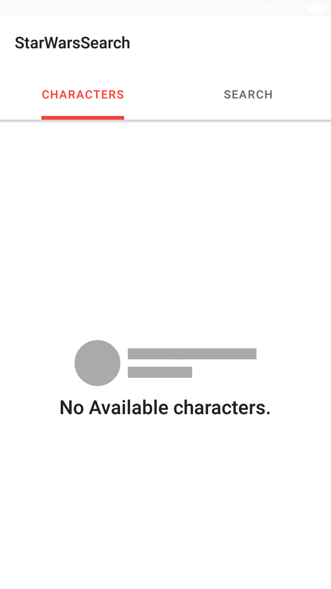

# StarWarsSearch
This is an android app that consumes the [Star wars API](https://swapi.dev/) to search characters and get to display their details such as name, specie, vehicles e.t.c.
The app is built using clean architecture and MVVM pattern.

The app is divided into the following modules:
- app
- data
- domain

### app
This contains all things related to the UI layer along with any other classes that are required for the UI.

### data
This module contains a networking layer and a database layer. The networking layer handles data interaction with the network and provides data to the presentation layer.
The database is responsible for persisting data locally and serve the data to the presentation layer(This is still under development :hammer_and_pick:)

### domain
The domain module defines the models core to the app, interactors(usecases) and repositories contract.

## Libraries
- [ViewModel](https://developer.android.com/topic/libraries/architecture/viewmodel) - stores and manages UI-related data in a lifecycle conscious way. Allows data to survive configuration changes such as screen rotation.
- [LiveData](https://developer.android.com/topic/libraries/architecture/livedata) - lifecycle-aware observable data holders. It only updates the app component observers that are in active lifecycle state.
- [Room](https://developer.android.com/training/data-storage/room) - persists our data locally. It provides an abstraction layer over SQLite.
- [Data binding](https://developer.android.com/topic/libraries/data-binding) - binds UI components in the layouts to data sources in the app.
- [Navigation component](https://developer.android.com/guide/navigation/navigation-getting-started) - handles navigation between fragments. The app uses a single-activity achitecture.
- [Kotlin Coroutines](https://developer.android.com/kotlin/coroutines) - executes code asynchronously.
- [Kotlin Flows](https://developer.android.com/kotlin/flow) - a type that can emit multiple values sequentially. It is conceptually a stream of data that can be computed asynchronously. Flows are built on top of ***coroutines***.
- [Retrofit](https://square.github.io/retrofit/) - a type-safe HTTP client.
- [okhttp-logging-interceptor](https://github.com/square/okhttp/tree/master/okhttp-logging-interceptor) - logs HTTP request and response data.
- [Gson](https://github.com/google/gson) - used to convert Java Objects into their JSON representation and vice versa.
- [Truth](https://github.com/google/truth) - assertion library that makes test assertions and failure messages more readable.
- [MockWebServer](https://github.com/square/okhttp/tree/master/mockwebserver) - web server fot testing HTTP clients. Makes it easy to test that your app does the right thing when it makes HTTP and HTTPS calls.

Some features are still under development :hammer_and_pick:

  
